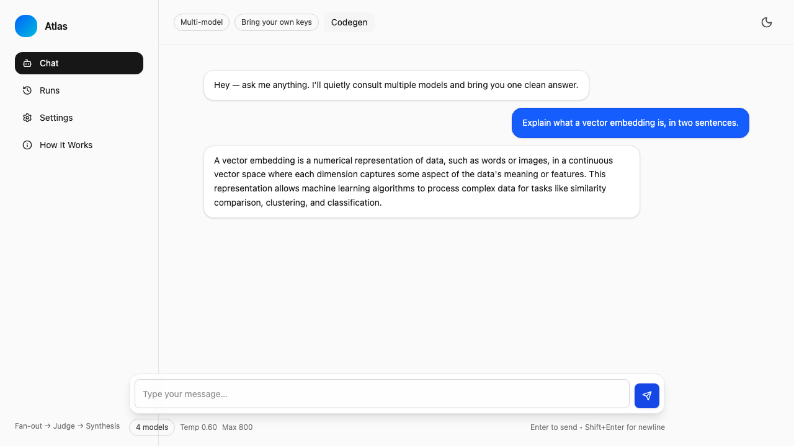
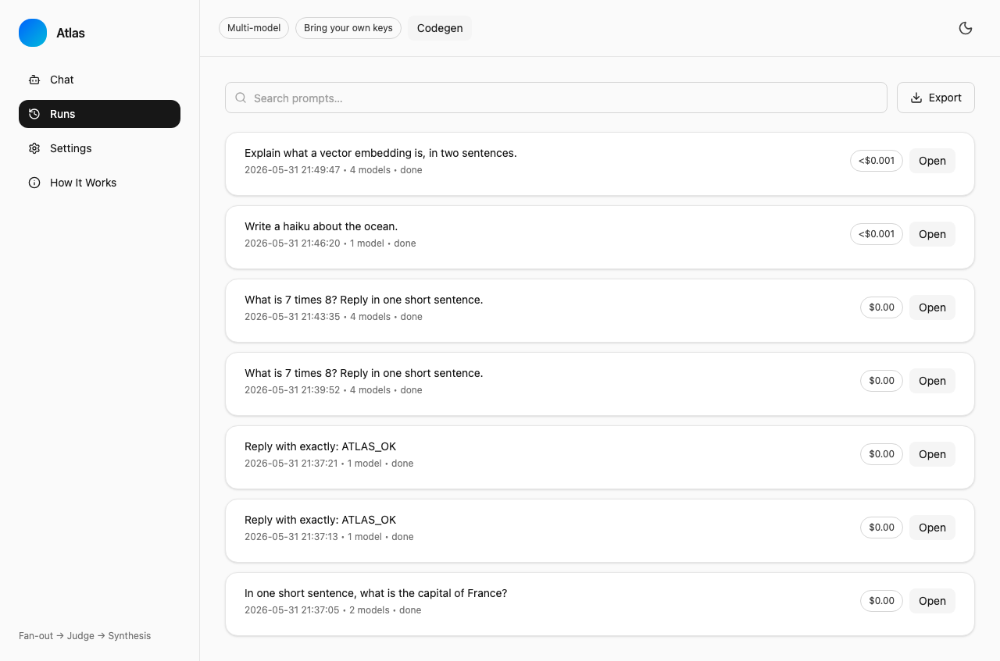

<div align="center">

# 🧠 Atlas

**A multi-model AI orchestrator with chat, code generation, and model comparison**

[](https://react.dev)
[](https://www.typescriptlang.org)
[](https://expressjs.com)
[](https://openai.com)
[](https://anthropic.com)
[](https://ai.google.dev)

[Features](#-features) · [Getting Started](#-getting-started) · [Tech Stack](#-tech-stack)

</div>

---

## ✨ Features

- **Multi-Model Chat** — Send prompts to multiple AI models simultaneously and compare responses
- **Model Support** — OpenAI (GPT-5, GPT-4.1, o1, o3, o4-mini), Anthropic (Claude), Google (Gemini), and more
- **Multi-Round Orchestration** — Generate, debate, critique, and revise across configurable rounds
- **Code Generation** — Describe a project spec and generate complete file structures as downloadable ZIP
- **Run History** — SQLite-backed history of all chat runs with search
- **Configurable Parameters** — Temperature, max tokens, timeout, cost caps, and model selection
- **Dark Mode** — Full theme support with system preference detection
- **API Key Management** — Securely store and manage keys for multiple providers

## 🖼️ Screenshots

<p align="center">
  
</p>
<p align="center">
  
</p>

## 🚀 Getting Started

### Prerequisites
- Node.js 18+
- API keys for at least one provider (OpenAI, Anthropic, or Google)

### Installation
```bash
git clone https://github.com/markksantos/Atlas.git
cd Atlas
npm install
```

> **Note:** Atlas uses `better-sqlite3`, a native module. If your npm config sets
> `ignore-scripts=true` (a common supply-chain hardening), the native binary
> won't compile during install. Build it explicitly once:
> ```bash
> npm_config_ignore_scripts=false npm rebuild better-sqlite3 --foreground-scripts
> ```

### Configuration
Copy `.env.example` to `.env` and add at least one provider key, or paste keys
into **Settings → API Keys** in the app (stored locally in SQLite):
```bash
cp .env.example .env
```
```bash
# .env — every key is optional; add the providers you want to use.
PORT=4000
OPENAI_API_KEY=sk-...
ANTHROPIC_API_KEY=sk-ant-...
GOOGLE_API_KEY=...          # Google Gemini (a.k.a. your Gemini API key)
XAI_API_KEY=...             # xAI / Grok
DEEPSEEK_API_KEY=...
Z_API_KEY=...               # Z.ai (GLM)
KIMI_API_KEY=...            # Moonshot / Kimi
QWEN_API_KEY=...            # Alibaba DashScope
```

Models you select without a configured key fail gracefully per-model — Atlas
still synthesizes an answer from whichever providers succeeded.

### Development
Runs the Express API (`:4000`) and the Vite dev server (`:5123`) together:
```bash
npm run dev
```
Open <http://localhost:5123>.

### Production
Build the static client and serve everything from the Express server:
```bash
npm run build      # outputs dist/
npm start          # NODE_ENV=production, serves dist/ + the API on :4000
```
Open <http://localhost:4000>. In production the server serves the built SPA with
a catch-all fallback, so the API and UI share one origin (no CORS, no proxy).

### Available scripts
| Script | What it does |
|--------|--------------|
| `npm run dev` | API + Vite dev server with hot reload |
| `npm run build` | Production build of the client to `dist/` |
| `npm start` | Production server (serves `dist/` + API) |
| `npm run typecheck` | `tsc --noEmit` across server and client |

## 🛠️ Tech Stack

| Category | Technology |
|----------|-----------|
| Frontend | React 19, TypeScript, Lucide Icons |
| Styling | Tailwind CSS 4 |
| Backend | Express 5, Node.js |
| Database | Better-SQLite3 |
| AI | OpenAI SDK, Anthropic SDK, Google Generative AI |
| Validation | Zod |
| Build | Vite 7, Concurrently |

## 🧠 How orchestration works

1. **Fan-out** — your prompt is dispatched to every selected model in parallel.
2. **Refine** — across `rounds` (default 2), each model silently critiques and
   improves its previous draft; with `debate` on it also folds in another
   model's draft.
3. **Judge** — candidates are ranked by a lightweight heuristic (prompt
   coverage, length, low repetition).
4. **Synthesize** — the top-ranked answer is returned as one clean response.

Token usage is tracked per call and turned into a USD cost estimate (OpenAI list
prices) shown on each run in **Runs**. Results stream to the client over SSE.

## 📁 Project Structure
```
Atlas/
├── client/
│   └── src/
│       ├── main.tsx              # React entry point
│       ├── App.tsx               # Thin wrapper
│       ├── atlas-single-file.tsx # Entire UI (chat, runs, settings, codegen)
│       └── styles.css            # Tailwind + custom utilities
├── server/
│   ├── index.ts          # Express app, /api/chat SSE, static serving
│   ├── routes.ts         # /api/runs, /api/codegen, zip download
│   └── lib/
│       ├── orchestrator.ts  # Multi-round fan-out → judge → synthesize
│       ├── providers.ts     # Provider clients + model-id mapping
│       ├── pricing.ts       # Token-usage → USD cost estimate
│       ├── codegen.ts       # Spec → file plan → per-file generation
│       ├── db.ts            # SQLite (runs + key store)
│       ├── keys.ts          # API key persistence
│       └── attachments.ts   # ZIP packaging
├── vite.config.ts
└── package.json
```

## 🚢 Deployment

Atlas is a single Node process that serves both the API and the built SPA, plus
a local SQLite file (`.data/atlas.sqlite`). It deploys anywhere that runs Node
with a persistent disk (a VM, a container, Fly.io, Railway, Render, etc.).

```bash
npm ci
npm_config_ignore_scripts=false npm rebuild better-sqlite3 --foreground-scripts
npm run build
NODE_ENV=production PORT=4000 npm start
```

Set provider keys as environment variables (or via Settings in the app). Mount
or persist the `.data/` directory to keep run history across restarts.

> Pure static/serverless hosts (e.g. Vercel/Netlify static) won't work as-is:
> the API is a stateful Express server with a native SQLite dependency. Use a
> container or a long-running Node host.

## 📄 License

MIT License © 2026 Mark Santos
